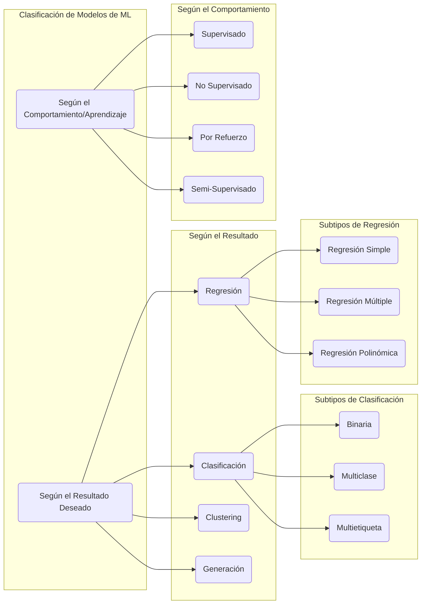

# Clasificación de Modelos de Machine Learning

Esta nota resume las principales formas de clasificar los modelos de Machine Learning, tanto por el tipo de resultado que producen como por su método de aprendizaje.

---

## Explicaciones Detalladas

### Según el Resultado Deseado

1.  **Clasificación**: Predice una etiqueta categórica (una clase discreta). Se utiliza para responder a preguntas como "¿Es esto A o B?".
    *   **Binaria**: Solo hay dos clases posibles (ej: `Sí/No`, `Gato/Perro`).
    *   **Multiclase**: Hay más de dos clases, pero cada instancia solo puede pertenecer a una de ellas (ej: `Coche/Moto/Camión`).
    *   **Multietiqueta**: Hay más de dos clases, y una instancia puede ser asignada a múltiples etiquetas a la vez (ej: una película puede ser `Acción`, `Comedia` y `Aventura`).

2.  **Regresión**: Predice una etiqueta con valor numérico continuo. Se usa para responder preguntas como "¿Cuánto?" o "¿Qué valor tendrá?".
    *   **Regresión Simple**: Predice un valor de salida usando una única variable de entrada.
    *   **Regresión Múltiple**: Predice un valor de salida usando múltiples variables de entrada.
    *   **Regresión Polinómica**: Modela la relación entre variables como un polinomio de n-ésimo grado, permitiendo capturar tendencias no lineales.

3.  **Clustering (Agrupamiento)**: Agrupa datos no etiquetados en "clusters" o conglomerados basándose en su similitud. El objetivo es que los puntos dentro de un mismo grupo sean muy similares entre sí y muy diferentes a los de otros grupos.

4.  **Generación**: Crea nuevos datos que imitan las propiedades de los datos de entrenamiento. Se utiliza en tareas como la generación de imágenes, texto o música (ej: GANs, VAEs).

### Según el Comportamiento (Tipo de Aprendizaje)

1.  **Aprendizaje Supervisado**: El modelo aprende de un conjunto de datos que ha sido previamente etiquetado por humanos. Se le proporcionan pares de "entrada-salida correcta" para que aprenda la relación entre ellos. Los problemas de **Clasificación** y **Regresión** son los casos de uso más comunes.

2.  **Aprendizaje No Supervisado**: El modelo trabaja con datos que no tienen etiquetas. Su objetivo es encontrar patrones, estructuras o anomalías por sí mismo. El **Clustering** es el ejemplo más representativo.

3.  **Aprendizaje por Refuerzo (Reinforcement Learning)**: El modelo (llamado "agente") aprende a tomar decisiones interactuando con un entorno. Recibe "recompensas" o "castigos" por sus acciones, y su objetivo es maximizar la recompensa total a lo largo del tiempo. Es común en robótica, juegos y sistemas de control.

4.  **Aprendizaje Semi-Supervisado**: Utiliza una combinación de una pequeña cantidad de datos etiquetados y una gran cantidad de datos no etiquetados. Es útil cuando el etiquetado de datos es caro o consume mucho tiempo.
